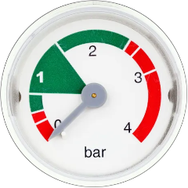
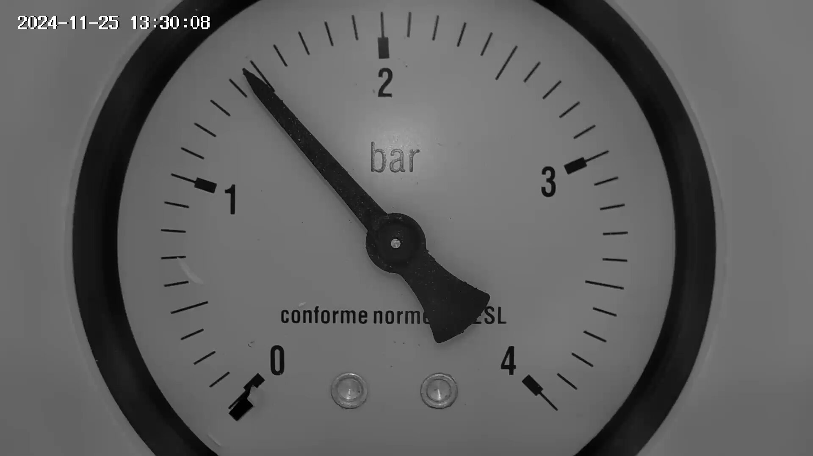
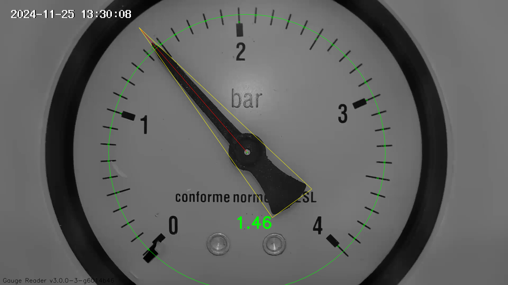

# gauge-reader

A script to read a value from the analog gauge.

## Project Goal

I need to remotely monitor the coolant pressure in the heating system 
in my house when I'm away and would like to integrate the monitoring 
into [Tuya](https://www.tuya.com/) and/or
[Home Assistant](https://www.home-assistant.io/).

It turned out that existing ready-made pressure measuring devices are
industrial, so they cannot be connected to existing smart home solutions.

However, I do not want to make a DIY sensor because it seems quite
complicated (current loop, ZigBee/WiFi module, firmware etc.) and
expensive. Instead, I decided to monitor the analog pressure gauge with
a Wi-Fi camera.

Obviosly, such a setup is enough for visual control of the pressure,
but I was curious if it is possible to convert the needle position to the
number with a kind of computer vision and pass it to my
[Home Assistant](https://www.home-assistant.io/) server.

All of the above led to the emergence of this project. 

## Hardware

### Pressure Gauge

After a lot of experiments with the built-in manometer (by Baxi)
that has a bunch of colorful sectors, no marks and a low-contrast
grey needle, I realized that a gauge must have as simple and
contrast dial as possible.



Finally, I settled on an ICMA 244 manometer that is widely available,
relatively cheap and has a clean minimalistic design.


### Camera

After some investigation, I settled on
[Ifeel Vega IFS-CI004](https://www.amazon.co.uk/Ifeel-Surveillance-IFS-CI004-Bi-directional-Compatible/dp/B0B9XWWRKW)
Wi-Fi camera. The main reason was that its diaeter is very close to the diameter
of the manometer. Also, it supports ONVIF and RTSP protocols.


### Assembly

[will follow soon]

## Software

The script is intended to run in a [**Home Assistant**](https://www.home-assistant.io/)
server with the [**pyscript**](https://github.com/custom-components/pyscript)
integration. It can also be run as a standalone script (i. e. in
JetBains [**Pycharm**](https://www.jetbrains.com/pycharm/)).

Python 3.12 is required.

### Installation in HA

[will follow soon]

### Running in a terminal

In the reading mode:
```shell
./run.py --debug --save-debug-image images/gauge.png 
```

In the test mode:
```shell
./run.py --test-mode "images/testing/gauge-{V}.(png|jpg)"
```

## Example

The original camera snapshot:



```sh
/usr/bin/python3.12 /data1/Projects/SmartHome/pressure_reader/git/run.py --debug --save-debug-image images/gauge.png 
INFO: Reading mode
INFO: Gauge Reader v3.0.0-3-g6014b46
INFO: Processing images/gauge.png
DEBUG: Average angle between marks: 6.92
DEBUG: Added a zero mark at angle 45.32169632249996
DEBUG: Added a missing mark at angle 141.72
DEBUG: Measured needle angle: 130.770094° (cartesian)
DEBUG: needle angle: absolute 130.770094°, relative 93.908209°
DEBUG: calculated value: 1.4640
DEBUG: Debug image saved as "images/gauge-debug.png"
INFO: value: 1.46
```

The image with some debugging drawings:



## Issues

* The script's would give a wrong result or crash when
  the needle is around zero.
